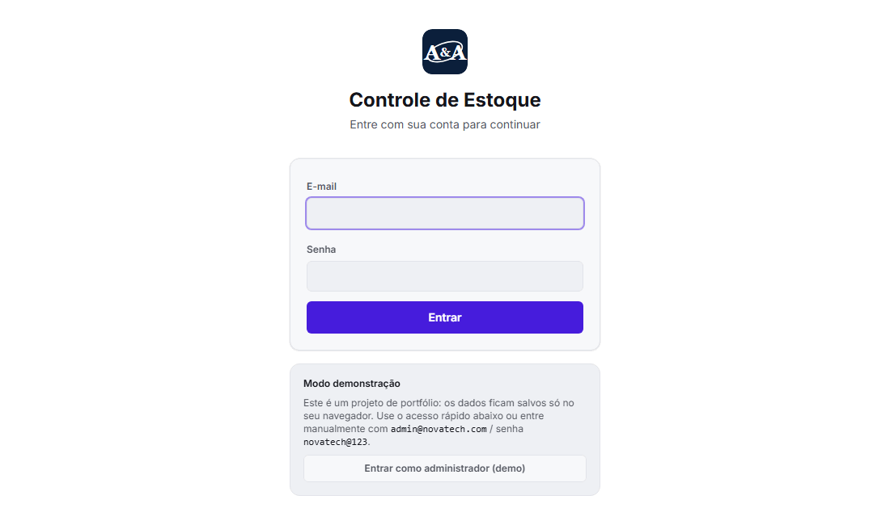

# NovaTech Controle de Estoque

App de controle de estoque de equipamentos cobrindo **duas sedes** (Campinas e São Paulo), com alerta de estoque
mínimo e cada retirada vinculada a um número de chamado. Roda **100% no navegador**: banco de dados SQLite real
(via [sql.js](https://sql.js.org/), WebAssembly), persistido no IndexedDB do visitante — sem servidor, sem backend.

**[Ver demonstração ao vivo →](https://andre-tech2.github.io/portfolio/controle-estoque/)**



> Projeto de portfólio: esta é uma versão adaptada, sem o empacotamento Electron, de uma ferramenta que
> desenvolvi para uso real como controle de estoque de TI. Nomes, e-mails e todos os dados cadastrados são
> fictícios.

## Funcionalidades

- Cadastro de equipamentos por sede, com categoria, unidade e regras de estoque mínimo/baixo/crítico
- Movimentações de saída/entrada em **lote** (vários itens sob o mesmo chamado/colaborador de uma vez), com
  validação de estoque disponível antes de aplicar qualquer alteração
- Cancelamento de movimentação (em vez de exclusão) — motivo obrigatório, reverte o estoque automaticamente e
  mantém o histórico
- Visão Geral com KPIs, gráfico de estoque vs. mínimo, gráfico de movimentações por dia e lista de alertas —
  tudo filtrável por sede e por período, reconstruindo a posição do estoque no fim do período escolhido
- Autenticação com três papéis de acesso (**visualizar**, **editar**, **gerenciar tudo**)
- Gestão de usuários e limiar do alerta "Baixo" configurável
- Modo demonstração: dados de exemplo pré-carregados e um botão para restaurá-los a qualquer momento

## Stack técnica

- **React 18 + TypeScript + Vite**
- **Tailwind CSS**
- **sql.js** — SQLite compilado para WebAssembly, rodando no navegador
- **Recharts** para os gráficos da Visão Geral
- **IndexedDB** — persistência local dos dados do visitante
- **Web Crypto API (PBKDF2)** — hash de senha, sem depender de backend

## Rodando localmente

```bash
npm install
npm run dev
```

Acesso rápido: na tela de login, use o botão **"Entrar como administrador (demo)"** ou as credenciais mostradas
na própria tela.

## Sobre a origem do projeto

Esta é uma versão adaptada, para fins de portfólio, de um sistema desktop (Electron) que eu desenvolvi para
controle real de estoque de TI. Nesta versão pública:

- O app roda inteiramente no navegador (sem Electron, sem Node no cliente)
- Todos os dados cadastrados são fictícios, gerados na hora em que a página é aberta pela primeira vez
- Exportação para Excel/PDF e importação de planilha existem no código (mesma lógica do app original) mas
  ficam desabilitadas nesta demonstração pública, junto com a troca de senha — a ideia é não distribuir arquivos
  a partir de um visitante desconhecido
