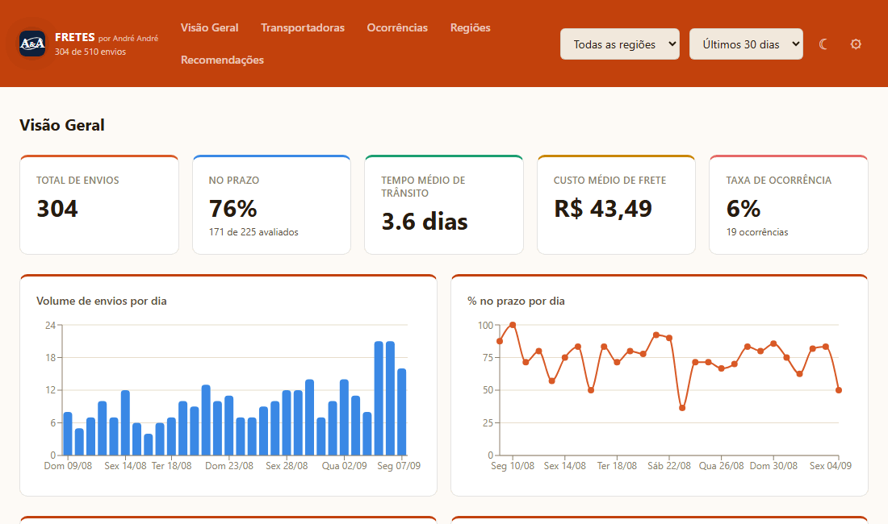

# NovaTech Fretes

Painel de desempenho de transportadoras: % no prazo, tempo de trânsito, taxa de ocorrência e custo de frete —
tudo calculado no navegador, com um motor de recomendações por regra (sem IA) apontando pontos de atenção.

**[Ver demonstração ao vivo →](https://andre-tech2.github.io/portfolio/fretes/)**



> Projeto de portfólio: generalização, para outro setor (logística), da mesma arquitetura usada no
> [Insight SD](../insight-sd) — importar/calcular métricas 100% no cliente, sem backend, sem IA. Os dados são
> sempre sintéticos, gerados na hora em que a página é aberta pela primeira vez.

## Páginas

| Página | O que mostra |
|---|---|
| **Visão Geral** | KPIs (total de envios, % no prazo, tempo médio de trânsito, custo médio de frete, taxa de ocorrência), volume e % no prazo por dia, ranking de transportadoras por índice de saúde, principais motivos de ocorrência |
| **Transportadoras** | Índice de saúde (combina % no prazo e ausência de ocorrência) e ranking completo ordenável (volume, % no prazo, trânsito médio, ocorrências, frete médio, atrasados) |
| **Ocorrências** | Lista de envios com problema (avaria, insucesso, extravio, devolução), filtável por transportadora e status |
| **Regiões** | Volume, % no prazo, trânsito médio e frete médio por UF, com destaque pra região com custo acima da média |
| **Recomendações** | Motor de regras (sem IA): transportadora com % no prazo ou ocorrência fora da média, volume geral de atraso alto, região com frete acima do esperado, alta recente de ocorrências |
| **Configurações** | Metas de % no prazo e de taxa de ocorrência aceitável, e restaurar os dados de exemplo |

## Por que esse projeto existe (e as decisões por trás dele)

O problema real: empresa que despacha por várias transportadoras não tem visão consolidada de quem está
atrasando, quem está gerando mais ocorrência (avaria, extravio, insucesso) ou quem está caro — cada problema
chega como reclamação de cliente isolada, não como padrão visível. Algumas decisões de design vêm direto dessa
dor:

- **Reaproveita a arquitetura do Insight SD quase inteira, só trocando o domínio.** Em vez de escrever um
  sistema do zero, generalizei o mesmo motor (métricas calculadas no cliente, recomendações por regra) pra um
  setor diferente — prova de que a solução original não era amarrada ao Service Desk.
- **"No prazo" só conta pra quem já chegou.** Um envio ainda em trânsito e dentro do prazo fica de fora do
  percentual (nem soma nem subtrai) — não dá pra julgar quem ainda pode chegar bem. Isso evita que o dashboard
  penalize injustamente uma transportadora só porque um envio recente ainda está a caminho.
- **"Ocorrência" (qualidade) e "atraso" (prazo) são medidos separadamente**, porque são coisas diferentes: um
  envio pode chegar avariado mas dentro do prazo, ou atrasar sem incidente nenhum. Misturar os dois esconderia
  qual é o problema real de cada transportadora.
- **Índice de saúde por transportadora redistribui peso quando falta um sinal** (ex: transportadora só com
  envios ainda em trânsito, sem % no prazo apurado ainda) — mesma lógica do índice de saúde do agente no
  Insight SD, pra não penalizar quem simplesmente não tem dado suficiente.
- **Dados sempre sintéticos, nunca reais.** Diferente do Insight SD (que também aceita importar um CSV real),
  aqui a demonstração é só uma prova de conceito genérica — não existe um sistema de gestão de fretes real por
  trás pra importar.

## Testes

Suíte automatizada com [Vitest](https://vitest.dev/), rodada no CI a cada push (bloqueia o deploy se falhar):

```bash
npm test
```

Cobre as regras de cálculo mais sensíveis a erro silencioso:

- **`lib/metrics/onTime.test.ts`** — regra de "no prazo" (o que conta, o que fica de fora do percentual)
- **`lib/metrics/delayed.test.ts`** — cálculo de horas de atraso e a lista ordenada de mais atrasados
- **`lib/metrics/carrierStats.test.ts`** — agregação por transportadora (volume, ocorrência, custo médio, trânsito médio)
- **`lib/metrics/carrierHealthScore.test.ts`** — índice de saúde, incluindo a redistribuição de peso quando falta um sinal
- **`lib/metrics/occurrences.test.ts`** — lista de ocorrências (motivo, data, ordenação)

## Stack técnica

- **Next.js 16** (App Router, export estático) + **React 19** + **TypeScript**
- **Tailwind CSS v4** para estilo, **Recharts** para os gráficos
- **IndexedDB** (`idb-keyval`) para persistência local — nada sai do navegador

## Dados de demonstração

`lib/seed/sampleShipments.ts` gera ~500 envios sintéticos na primeira vez que o app roda no seu navegador,
sempre ancorados na data atual. Os desequilíbrios são propositais (uma transportadora com % no prazo e taxa de
ocorrência ruins, uma região com frete acima da média) pra a página de Recomendações ter o que mostrar. Dá pra
gerar um novo conjunto a qualquer momento em Configurações.

## Rodando localmente

```bash
npm install
npm run dev     # http://localhost:3000
npm run build   # export estático em out/
npm test        # suíte de testes
```
